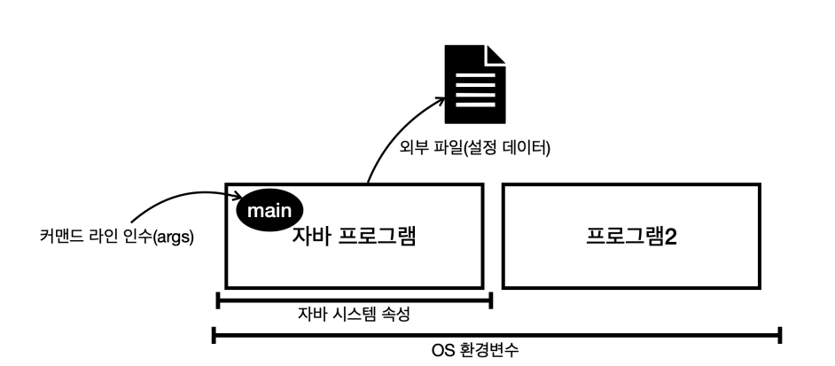
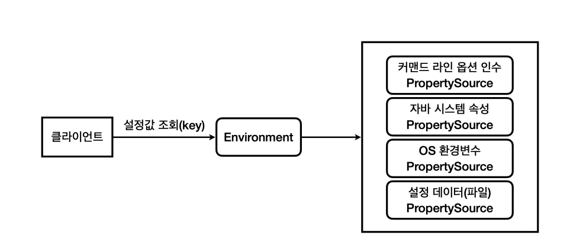
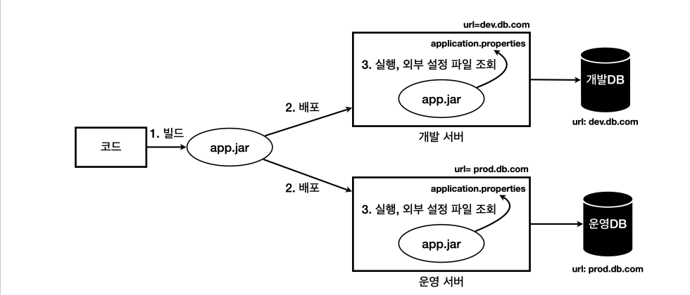
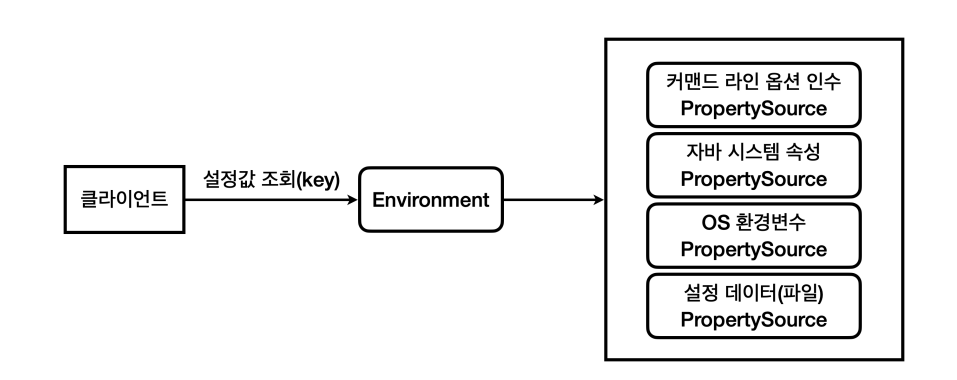

# 외부설정과 프로필

### 외부 설정

* 외부 설정은 일반적으로 다음 4가지 방법이 있다.
  * OS 환경 변수: OS에서 지원하는 외부 설정, 해당 OS를 사용하는 모든 프로세스에서 사용
  * 자바 시스템 속성: 자바에서 지원하는 외부 설정, 해당 JVM안에서 사용
  * 자바 커맨드 라인 인수: 커맨드 라인에서 전달하는 외부 설정, 실행시 main(args) 메서드에서 사용
  * 외부 파일(설정 데이터): 프로그램에서 외부 파일을 직접 읽어서 사용
    * 애플리케이션에서 특정 위치의 파일을 읽도록 해둔다. 예) data/hello.txt
    * 그리고 각 서버마다 해당 파일안에 다른 설정 정보를 남겨둔다.
      * 개발 서버 hello.txt : url=dev.db.com
      * 운영 서버 hello.txt : url=prod.db.com

#### 자바 시스템 속성을 자바 코드로 설정하기
자바 시스템 속성은 앞서 본 것 처럼 -D 옵션을 통해 실행 시점에 전달하는 것도 가능하고, 다음과 같이 자바 코드 내부  
에서 추가하는 것도 가능하다. 코드에서 추가하면 이후에 조회시에 값을 조회할 수 있다.  
* 설정: System.setProperty(propertyName, "propertyValue")  
* 조회: System.getProperty(propertyName)  

### 외부 설정 - 커맨드 라인 옵션 인수
일반적인 커맨드 라인 인수
커맨드 라인에 전달하는 값은 형식이 없고, 단순히 띄어쓰기로 구분한다.
* aaa bbb [aaa, bbb] 값 2개
* hello world [hello, world] 값 2개
* "hello world" [hello world] (공백을 연결하려면 " 를 사용하면 된다.) 값 1개
* key=value [key=value] 값 1개

#### 커맨드 라인 옵션 인수(command line option arguments)
커맨드 라인 인수를 key=value 형식으로 구분하는 방법이 필요하다. 그래서 스프링에서는 커맨드 라인 인수를  
key=value 형식으로 편리하게 사용할 수 있도록 스프링 만의 표준 방식을 정의했는데, 그것이 바로 커맨드 라인 옵  
션 인수이다.

스프링은 커맨드 라인에 - (dash) 2개( -- )를 연결해서 시작하면 key=value 형식으로 정하고 이것을 커맨드 라인  
옵션 인수라 한다.  
* --key=value 형식으로 사용한다.
* --username=userA --username=userB 하나의 키에 여러 값도 지정할 수 있다

### 외부 설정 - 스프링 통합

#### PropertySource
* org.springframework.core.env.PropertySource
* 스프링은 PropertySource 라는 추상 클래스를 제공하고, 각각의 외부 설정를 조회하는
XxxPropertySource 구현체를 만들어두었다.
  * 예)
  * CommandLinePropertySource
  * SystemEnvironmentPropertySource
* 스프링은 로딩 시점에 필요한 PropertySource 들을 생성하고, Environment 에서 사용할 수 있게 연결해둔다.

#### Environment
* org.springframework.core.env.Environment
* Environment 를 통해서 특정 외부 설정에 종속되지 않고, 일관성 있게 key=value 형식의 외부 설정에
  접근할 수 있다.
  * environment.getProperty(key) 를 통해서 값을 조회할 수 있다.
  * Environment 는 내부에서 여러 과정을 거쳐서 PropertySource 들에 접근한다.
  * 같은 값이 있을 경우를 대비해서 스프링은 미리 우선순위를 정해두었다. (뒤에서 설명한다.)
* 모든 외부 설정은 이제 Environment 를 통해서 조회하면 된다.

#### 우선순위
예를 들어서 커맨드 라인 옵션 인수와 자바 시스템 속성을 다음과 같이 중복해서 설정하면 어떻게 될까?  
* 커맨드 라인 옵션 인수 실행  
  * --url=proddb --username=prod_user --password=prod_pw  
* 자바 시스템 속성 실행  
  * -Durl=devdb -Dusername=dev_user -Dpassword=dev_pw  
    우선순위는 상식 선에서 딱 2가지만 기억하면 된다.  
* 더 유연한 것이 우선권을 가진다. (변경하기 어려운 파일 보다 실행시 원하는 값을 줄 수 있는 자바 시스템  
  속성이 더 우선권을 가진다.)
* 범위가 넒은 것 보다 좁은 것이 우선권을 가진다. (자바 시스템 속성은 해당 JVM 안에서 모두 접근할 수 있  
  다. 반면에 커맨드 라인 옵션 인수는 main 의 arg를 통해서 들어오기 때문에 접근 범위가 더 좁다.)  

자바 시스템 속성과 커맨드 라인 옵션 인수의 경우 커맨드 라인 옵션 인수의 범위가 더 좁기 때문에 커맨드 라인 옵션 인
수가 우선권을 가진다.

### 설정 데이터1 - 외부 파일

application.properties 개발 서버에 있는 외부 파일 
```properties
url=dev.db.com
username=dev_user
password=dev_pw
 ```
application.properties 운영 서버에 있는 외부 파일 
```properties
url=prod.db.com
username=prod_user
password=prod_pw
```

#### 스프링과 설정 데이터
개발자가 파일을 읽어서 설정값으로 사용할 수 있도록 개발을 해야겠지만, 스프링 부트는 이미 이런 부분을 다 구현해두
었다. 개발자는 application.properties 라는 이름의 파일을 자바를 실행하는 위치에 만들어 두기만 하면 된다.
그러면 스프링이 해당 파일을 읽어서 사용할 수 있는 PropertySource 의 구현체를 제공한다. 스프링에서는 이러한
application.properties 파일을 설정 데이터(Config data)라 한다.  


동작 확인
* ./gradlew clean build
* build/libs 로 이동
* 해당 위치에 application.properties 파일 생성
```properties
url=dev.db.com
username=dev_user
password=dev_pw 
```
* java -jar external-0.0.1-SNAPSHOT.jar 실행

### 설정 데이터2 - 내부 파일 분리
#### 스프링과 내부 설정 파일 읽기
main/resources 에 다음 파일을 추가하자

application-dev.properties 개발 프로필에서 사용 
```properties
url=dev.db.com
username=dev_user
password=dev_pw 
```

application-prod.properties 운영 프로필에서 사용 
```properties
url=prod.db.com
username=prod_user
password=prod_pw 
```

프로필
스프링은 이런 곳에서 사용하기 위해 프로필이라는 개념을 지원한다.  
spring.profiles.active 외부 설정에 값을 넣으면 해당 프로필을 사용한다고 판단한다.  
그리고 프로필에 따라서 다음과 같은 규칙으로 해당 프로필에 맞는 내부 파일(설정 데이터)을 조회한다.  
* application-{profile}.properties

예)
* spring.profiles.active=dev
  * dev 프로필이 활성화 되었다.
  * application-dev.properties 를 설정 데이터로 사용한다.
* spring.profiles.active=prod
  * prod 프로필이 활성화 되었다.
  * application-prod.properties 를 설정 데이터로 사용한다.
실행
* IDE에서 커맨드 라인 옵션 인수 실행
  * --spring.profiles.active=dev
* IDE에서 자바 시스템 속성 실행
  * -Dspring.profiles.active=dev
* Jar 실행
  * ./gradlew clean build
  * build/libs 로 이동
  * java -Dspring.profiles.active=dev -jar external-0.0.1-SNAPSHOT.jar
  * java -jar external-0.0.1-SNAPSHOT.jar --spring.profiles.active=dev

### 설정 데이터3 - 내부 파일 합체

* 기존에는 dev 환경은 application-dev.properties , prod 환경은 application-prod.properties 파일이 필요했다.
* 스프링은 하나의 application.properties 파일 안에서 논리적으로 영역을 구분하는 방법을 제공한다.
* application.properties 라는 하나의 파일 안에서 논리적으로 영역을 나눌 수 있다.
  * application.properties 구분 방법 #--- 또는 !--- (dash 3)
  * application.yml 구분 방법 --- (dash 3)
* 그림의 오른쪽 application.properties 는 하나의 파일이지만 내부에 2개의 논리 문서로 구분되어 있다.
  * dev 프로필이 활성화 되면 상위 설정 데이터가 사용된다.
  * prod 프로필이 활성화 되면 하위 설정 데이터가 사용된다.
* 프로필에 따라 논리적으로 구분된 설정 데이터를 활성화 하는 방법
  * spring.config.activate.on-profile 에 프로필 값 지정

### 우선순위 - 전체
스프링 부트는 같은 애플리케이션 코드를 유지하면서 다양한 외부 설정을 사용할 수 있도록 지원한다.
>>> 외부 설정에 대한 우선순위 - 스프링 공식 문서
>>> https://docs.spring.io/spring-boot/docs/current/reference/html/features.html#features.external-config

우선순위는 위에서 아래로 적용된다. 아래가 더 우선순위가 높다.

#### 자주 사용하는 우선순위
* 설정 데이터( application.properties )
* OS 환경변수
* 자바 시스템 속성
* 커맨드 라인 옵션 인수
* @TestPropertySource (테스트에서 사용)

#### 설정 데이터 우선순위
* jar 내부 application.properties
* jar 내부 프로필 적용 파일 application-{profile}.properties
* jar 외부 application.properties
* jar 외부 프로필 적용 파일 application-{profile}.properties

>>> 설정 데이터 우선순위 - 스프링 공식 문서
>>> https://docs.spring.io/spring-boot/docs/current/reference/html/features.html#features.external-config.files

#### 우선순위 이해 방법
우선순위는 상식 선에서 딱 2가지만 생각하면 된다.
* 더 유연한 것이 우선권을 가진다. (변경하기 어려운 파일 보다 실행시 원하는 값을 줄 수 있는 자바 시스템 속성이 더 우선권을 가진다.)
* 범위가 넒은 것 보다 좁은 것이 우선권을 가진다.
  * OS 환경변수 보다 자바 시스템 속성이 우선권이 있다.
  * 자바 시스템 속성 보다 커맨드 라인 옵션 인수가 우선권이 있다.


